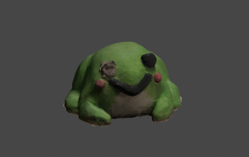
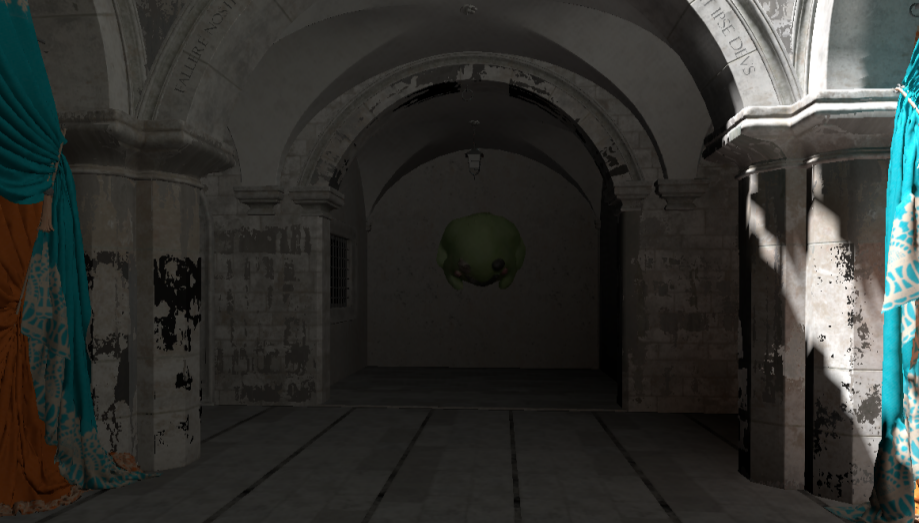
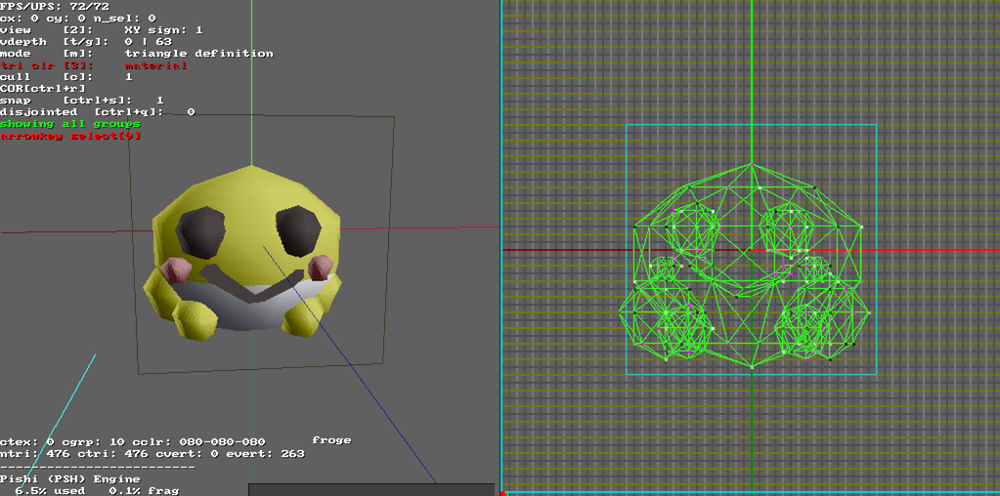

# good-froge

Our server mascot :)

Thank you clepirelli's good froge for the initial marzipan version and Herald for the clay remake + photogrammetry build <3

There is also a trimmed version available as `.glb`

[SM\_Good\_Froge\_LP\_Trimmed](SM_Good_Froge_LP_Trimmed.glb)

***
#### Good froge visited Intel's Sponza recently
[Good Froge In Sponza](Good_Froge_In_Sponza/scene.glb)

Note: Scene geometry is decimated to 25% and textures 1/8th their original size (512x512 instead of 4096x4096)

#### DMDL and DPRJ formats used in King's Crook (https://kingscrook.itch.io/kings-crook)

DMDL being the exported model format and DPRJ being the project file for the custom model editor.

